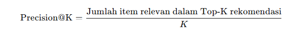

# Laporan Proyek Machine Learning - Rahmah Sary Fadiyah


## Project Overview

Seiring dengan pesatnya pertumbuhan industri hiburan digital, terutama platform layanan streaming seperti Netflix, Disney+, dan Amazon Prime, pengguna dihadapkan pada pilihan ribuan film dan serial setiap harinya. Tantangan utama yang muncul adalah bagaimana menyajikan konten yang relevan dan sesuai dengan preferensi pengguna tanpa membuat mereka kewalahan dengan terlalu banyak pilihan. Oleh karena itu, sistem rekomendasi menjadi komponen penting dalam meningkatkan pengalaman pengguna, dengan menyarankan konten yang kemungkinan besar akan disukai pengguna, sekaligus memperkuat peran online review sebagai faktor yang memengaruhi keputusan menonton secara lebih personal dan berbasis data [1].

Masalah utama yang hendak diselesaikan adalah bagaimana mengidentifikasi film yang relevan bagi pengguna secara personal. Tanpa sistem rekomendasi yang efektif, pengguna bisa merasa frustasi dan kehilangan ketertarikan pada layanan yang ditawarkan. Sistem rekomendasi dapat mengatasi permasalahan ini dengan menganalisis preferensi pengguna serta kesamaan antar konten atau antar pengguna lainnya [2].

## Business Understanding
### Problem Statements

- Bagaimana cara merekomendasikan film yang memiliki kemiripan konten seperti genre dengan film yang disukai pengguna?
- Bagaimana cara menyajikan rekomendasi film secara relevan untuk pengguna baru (cold-start user) yang belum memiliki riwayat interaksi?

### Goals
- Merekomendasikan film yang memiliki kemiripan genre dengan film yang disukai pengguna dan mempermudah pengguna dalam menemukan film baru yang sesuai dengan selera mereka, tanpa harus bergantung pada preferensi pengguna lain.
- Mengatasi masalah cold-start untuk pengguna baru dengan memberikan rekomendasi berdasarkan metadata dari film yang pernah ditonton atau dicari, bukan dari interaksi historis.

    ### Solution statements
    - Content-Based Filtering (CBF)
      Pendekatan ini memanfaatkan data atribut film seperti genre, keywords, overview, cast, dan director untuk membuat profil film dan profil preferensi pengguna. Sistem akan merekomendasikan film yang memiliki kemiripan konten dengan film-film yang pernah disukai atau ditonton oleh pengguna. Dengan demikian, pengguna dapat menemukan film yang sesuai selera secara cepat dan tepat.
    - Evaluasi
      Sistem rekomendasi ini akan dievaluasi menggunakan metrik precision untuk mengukur seberapa relevan film-film yang direkomendasikan terhadap preferensi pengguna. Nilai precision yang tinggi menunjukkan bahwa sebagian besar rekomendasi yang diberikan memang sesuai dan disukai oleh pengguna


## Data Understanding
Dataset yang digunakan dalam proyek ini berisi informasi tentang film-film yang tersedia pada sebuah platform streaming. Dataset terdiri dari **4.803 entri film** dengan berbagai atribut yang menggambarkan karakteristik film tersebut. Data ini mencakup informasi seperti genre, judul asli, bahasa, durasi, tanggal rilis, dan rating film. Dataset ini berasal dari [The Movie Database](https://www.kaggle.com/datasets/abdallahwagih/movies) dataset yang dapat diunduh secara gratis dari Kaggle.
Selanjutnya, uraikanlah seluruh variabel atau fitur pada data dengan jumlah **24 kolom** sebagai berikut: 
- index : Nomor indeks baris data.
- budget : Anggaran produksi film dalam satuan dolar.
- genres : Genre atau kategori film (misalnya Drama, Action).
- homepage : URL situs resmi film (jika tersedia).
- id : ID unik film.
- keywords : Kata kunci yang mendeskripsikan film.
- original_language : Bahasa asli film.
- original_title : Judul asli film.
- overview : Ringkasan cerita film.
- popularity : Skor popularitas film berdasarkan metrik internal platform.
- production_companies : Perusahaan produksi film.
- production_countries : Negara tempat film diproduksi.
- release_date : Tanggal rilis film.
- revenue : Pendapatan film dalam satuan dolar.
- runtime : Durasi film dalam menit.
- spoken_languages : Bahasa yang digunakan dalam film.
- status : Status rilis film (misalnya Released).
- tagline : Slogan film.
- title : Judul film.
- vote_average : Rata-rata rating film dari pengguna
- vote_count : Jumlah pengguna yang memberikan rating.
- cast : Daftar aktor utama dalam film.
- crew : Daftar kru produksi film.
- director : Sutradara film.

dengan tipe data seperti berikut: 
| #  | Column                | Non-Null Count | Dtype   |
|-----|----------------------|----------------|---------|
| 0   | index                 | 4803 non-null  | int64   |
| 1   | budget                | 4803 non-null  | int64   |
| 2   | genres                | 4775 non-null  | object  |
| 3   | homepage              | 1712 non-null  | object  |
| 4   | id                    | 4803 non-null  | int64   |
| 5   | keywords              | 4391 non-null  | object  |
| 6   | original_language     | 4803 non-null  | object  |
| 7   | original_title        | 4803 non-null  | object  |
| 8   | overview              | 4800 non-null  | object  |
| 9   | popularity            | 4803 non-null  | float64 |
| 10  | production_companies  | 4803 non-null  | object  |
| 11  | production_countries  | 4803 non-null  | object  |
| 12  | release_date          | 4802 non-null  | object  |
| 13  | revenue               | 4803 non-null  | int64   |
| 14  | runtime               | 4801 non-null  | float64 |
| 15  | spoken_languages      | 4803 non-null  | object  |
| 16  | status                | 4803 non-null  | object  |
| 17  | tagline               | 3959 non-null  | object  |
| 18  | title                 | 4803 non-null  | object  |
| 19  | vote_average          | 4803 non-null  | float64 |
| 20  | vote_count            | 4803 non-null  | int64   |
| 21  | cast                  | 4760 non-null  | object  |
| 22  | crew                  | 4803 non-null  | object  |
| 23  | director              | 4773 non-null  | object  |

| Statistik | index  |     budget     |      id       |  popularity  |    revenue    |  runtime  | vote_average | vote_count |
|-----------|--------|---------------|--------------|--------------|---------------|-----------|--------------|------------|
| count     | 4803   | 4,803         | 4803         | 4803         | 4,803         | 4801      | 4803         | 4803       |
| mean      | 2401.0 | 29,045,040.43 | 57,165.48    | 21.49        | 82,260,640.64 | 106.88    | 6.09         | 690.22     |
| std       | 1386.65| 40,722,390.33 | 88,694.61    | 31.82        | 162,857,100.87| 22.61     | 1.19         | 1234.59    |
| min       | 0      | 0             | 5            | 0            | 0             | 0         | 0            | 0          |
| 25%       | 1200.5 | 790,000       | 9,014.5      | 4.67         | 0             | 94.0      | 5.6          | 54         |
| 50%       | 2401.0 | 15,000,000    | 14,629       | 12.92        | 19,170,000    | 103.0     | 6.2          | 235        |
| 75%       | 3601.5 | 40,000,000    | 58,610.5     | 28.31        | 92,917,190    | 118.0     | 6.8          | 737        |
| max       | 4802   | 380,000,000   | 459,488      | 875.58       | 2,787,965,000 | 338.0     | 10           | 13,752     |
Penjelasan:
- Data menunjukkan variasi besar dalam anggaran, popularitas, dan pendapatan film, mencerminkan perbedaan antara film low-budget hingga blockbuster.
- Sebagian data seperti anggaran dan revenue mengandung nilai 0, mungkin perlu diproses lebih lanjut untuk mengatasi data hilang.
- Durasi film rata-rata sekitar 1,5 jam, cukup standar untuk film bioskop.
- Rating dan jumlah voting bervariasi, memungkinkan analisis lebih lanjut untuk mencari film dengan kualitas dan popularitas tinggi.

**Kondisi dari data**:
- missing value

  | Kolom                | Jumlah Missing Value |
  |----------------------|---------------------:|
  | index                | 0                    |
  | budget               | 0                    |
  | genres               | 28                   |
  | homepage             | 3091                 |
  | id                   | 0                    |
  | keywords             | 412                  |
  | original_language    | 0                    |
  | original_title       | 0                    |
  | overview             | 3                    |
  | popularity           | 0                    |
  | production_companies | 0                    |
  | production_countries | 0                    |
  | release_date         | 1                    |
  | revenue              | 0                    |
  | runtime              | 2                    |
  | spoken_languages     | 0                    |
  | status               | 0                    |
  | tagline              | 844                  |
  | title                | 0                    |
  | vote_average         | 0                    |
  | vote_count           | 0                    |
  | cast                 | 43                   |
  | crew                 | 0                    |
  | director             | 30                   |

Penjelasaanya:
    - Kolom homepage memiliki jumlah missing value paling banyak yaitu 3091, ini karena tidak semua film memiliki halaman resmi.
    - Beberapa kolom seperti genres, keywords, tagline, cast, dan director juga memiliki missing value yang cukup signifikan, perlu dipertimbangkan saat analisis.
    - Kolom penting seperti budget, revenue, vote_average, dan title tidak memiliki missing value, sehingga data utama terkait performa film relatif lengkap.
    - Data missing di kolom seperti runtime 2 dan release_date 1 sangat sedikit, tagline memiliki 844, cast 43, direktur 30,genres 28, dan keyword 412
    
- Duplikat data
 Data yang digunakan dalam dataset ini telah melalui proses pengecekan untuk memastikan keunikan setiap entri. Hasil pemeriksaan menunjukkan bahwa tidak terdapat duplikat data pada seluruh baris dataset, yang berarti setiap rekaman film adalah unik dan tidak berulang.


| Fitur 1        | Fitur 2      | Korelasi | Interpretasi                                                                               |
| -------------- | ------------ | -------- | ------------------------------------------------------------------------------------------ |
| `popularity`   | `vote_count` | 0.78     | Sangat kuat positif — Film yang populer cenderung mendapat banyak vote.                    |
| `budget`       | `vote_count` | 0.59     | Cukup kuat positif — Film dengan anggaran besar cenderung mendapat lebih banyak suara.     |
| `budget`       | `popularity` | 0.51     | Sedang positif — Film dengan budget besar cenderung populer.                               |
| `vote_average` | `runtime`    | 0.38     | Lemah hingga sedang — Film yang lebih lama cenderung mendapat rating sedikit lebih tinggi. |
| `vote_average` | `budget`     | 0.09     | Sangat lemah — Budget tidak berpengaruh signifikan ke rating.                              |


## Data Preparation

- **Membuat sebuah DataFrame baru** bernama movie_new yang hanya berisi tiga kolom penting (id, movie_name, dan genre) dari DataFrame asli df. Tujuannya adalah untuk menyederhanakan data agar bisa digunakan lebih mudah untuk keperluan seperti sistem rekomendasi berbasis konten (Content-Based Filtering / CBF).

- **Menghapus missing value** jumlah data dan kolom setelah dihapus adalah 4775 baris dan 3 kolom

## Modeling

1. **Content-Based Filtering (CBF)**
   Content-Based Filtering merupakan pendekatan sistem rekomendasi yang merekomendasikan item (dalam hal ini film) kepada pengguna berdasarkan kemiripan konten (genre, deskripsi, dan informasi metadata lainnya) dengan film yang pernah disukai atau ditonton oleh pengguna tersebut. Berikut adalah penjelasan **per bagian kode** dari implementasi sistem **Content-Based Filtering (CBF)**:
    - **Inisialisasi TfidfVectorizer**
      - `tf = TfidfVectorizer()` Membuat objek TfidfVectorizer dari Scikit-learn.
      - `tf.fit(movie_new['genre'])` Proses fit dilakukan ke kolom 'genre' dari DataFrame movie_new.
      -  `tf.get_feature_names_out()` Mengambil daftar semua fitur unik (genre terms) yang ditemukan oleh TfidfVectorizer
        
    - **tfidf_matrix**
      - `tf.fit_transform(movie_new['genre'])` Menerapkan fit() untuk mempelajari semua kata unik dalam genre. Kemudian langsung transform() untuk mengubah tiap genre film menjadi vektor numerik berdimensi jumlah kata unik (dalam semua genre).
      - `tfidf_matrix.shape` Mengembalikan tuple (baris, kolom)
        
    - **`tfidf_matrix.todense()`** akan mengubah matriks TF-IDF yang awalnya berbentuk sparse (jarang) menjadi bentuk dense (penuh), yaitu array 2D berisi nilai bobot TF-IDF untuk setiap genre di setiap film. Hasilnya bisa sangat besar tergantung jumlah film dan jumlah fitur unik.
      
    - **melihat sebagian kecil dari matriks TF-IDF**
        - `tfidf_matrix.todense()` Mengubah matriks TF-IDF yang berupa sparse matrix menjadi matriks dense (biasa) agar mudah diolah dalam bentuk DataFrame. Ini membuat seluruh data TF-IDF menjadi array 2 dimensi.
         - `columns=tf.get_feature_names_out()` Memberikan nama kolom DataFrame sesuai fitur-fitur yang ditemukan oleh `TfidfVectorizer`. Fitur-fitur ini adalah kata-kata unik dari kolom `genre` setelah diproses TF-IDF.
         - `index=movie_new.movie_name` Menjadikan nama film (`movie_name`) sebagai label baris (index) pada DataFrame sehingga setiap baris merepresentasikan sebuah film.
         - `.sample(22, axis=1)` Mengambil sampel 22 kolom (fitur genre) secara acak dari keseluruhan fitur TF-IDF. `axis=1` berarti sampling pada kolom.
         - `.sample(10, axis=0)` Mengambil sampel 10 baris (film) secara acak dari keseluruhan film yang ada. `axis=0` berarti sampling pada baris
    - **cosine_sim**
      -  Fungsi `cosine_similarity()` menghitung kemiripan antar baris dalam matriks `tfidf_matrix` berdasarkan sudut kosinusnya
      -  Karena `tfidf_matrix` adalah representasi TF-IDF untuk genre tiap film, hasil `cosine_sim` adalah matriks persegi (square matrix) yang menunjukkan tingkat kemiripan genre antar setiap pasangan film.
      -  Setiap nilai dalam `cosine_sim` berada di rentang 0 sampai 1, di mana 1 berarti genre dua film sangat mirip (identik), dan 0 berarti tidak ada kesamaan sama sekali.
   - **membuat DataFrame matriks kemiripan film**
     - `cosine_sim_df = pd.DataFrame(cosine_sim, index=movie_new['movie_name'], columns=movie_new['movie_name'])` Membuat DataFrame pandas dari matriks cosine_sim. Baris dan kolom diberi label menggunakan nama film (movie_new['movie_name']) agar lebih mudah dibaca dan diakses berdasarkan judul film.
     - `print('Shape:', cosine_sim_df.shape)` Mencetak bentuk (jumlah baris dan kolom) dari DataFrame cosine_sim_df.Karena matriks kemiripan persegi, bentuknya adalah (jumlah film, jumlah film).
     - `cosine_sim_df.sample(5, axis=1).sample(10, axis=0)` Mengambil sampel acak 5 kolom (film) dari DataFrame, lalu dari hasil tersebut mengambil sampel acak 10 baris (film). Ini berguna untuk melihat sebagian kecil matriks kemiripan film tanpa harus menampilkan semuanya, agar lebih ringkas dan mudah dianalisis.
       
    - Berikut penjelasan tiap bagian fungsi `movie_recommendations`:
      - Fungsi menerima `nama_movie` sebagai film referensi, `similarity_data` berupa DataFrame kemiripan, `items` data film (judul & genre), dan `k` jumlah rekomendasi.
      - `similarity_data.loc[:, nama_movie].to_numpy()` mengambil kolom kemiripan film terhadap `nama_movie` dan mengubahnya jadi array NumPy.
      - `.argpartition(range(-1, -k, -1))` mencari indeks `k` film dengan nilai kemiripan tertinggi secara efisien.
      - `closest` berisi nama film-film dengan kemiripan tertinggi tersebut.
      - Film yang sama dengan `nama_movie` dihapus agar tidak merekomendasikan film itu sendiri.
      - Hasil dikembalikan sebagai DataFrame berisi judul dan genre dari film-film rekomendasi


## Evaluation

Dalam proyek sistem rekomendasi ini, digunakan Precision\@K mengukur seberapa tepat rekomendasi yang diberikan dalam daftar Top-K dibandingkan dengan item yang memang relevan bagi pengguna.

   Formula Precision\@K:

   

   Precision\@K membantu menilai kualitas rekomendasi yang bersifat personal dan berbasis konten, dimana fokusnya adalah meminimalkan rekomendasi yang tidak relevan bagi pengguna.
   - Penjelasan code evaluasi:
     Berikut adalah **penjelasan baris per baris** dari kode yang kamu tulis untuk menghitung *Precision\@5* pada sistem **Content-Based Filtering (CBF)**

1. **Mengambil genre film input**

   ```python
   genre_input = items[items['movie_name'] == movie_input]['genre'].values[0]
   ```

   Ambil genre film yang menjadi acuan (misalnya "Avatar") dari dataframe `items`.

2. **Mengambil genre dari film-film hasil rekomendasi**

   ```python
   rekom_genres = rekomendasi_df['genre'].tolist()
   ```

   Buat daftar genre dari setiap film yang direkomendasikan.

3. **Menghitung berapa banyak rekomendasi yang relevan**

   ```python
   relevan = sum([genre_input == g for g in rekom_genres])
   ```

   Hitung jumlah film rekomendasi yang genre-nya sama persis dengan genre film input.

4. **Menghitung total rekomendasi**

   ```python
   total_rekom = len(rekom_genres)
   ```

   Hitung jumlah total film yang direkomendasikan.

5. **Menghitung presisi**

   ```python
   presisi = relevan / total_rekom if total_rekom > 0 else 0
   ```

   Presisi adalah rasio jumlah rekomendasi yang relevan terhadap total rekomendasi, atau nol jika tidak ada rekomendasi.

6. **Mengembalikan nilai presisi**

   ```python
   return presisi
   ```

   Kembalikan nilai presisi yang sudah dihitung.

---

**Contoh Pemakaian**

1. **Cek apakah film "Avatar" ada di data similarity matrix**

   ```python
   if 'Avatar' in cosine_sim_df.index:
   ```

2. **Mengambil 5 rekomendasi film untuk "Avatar"**

   ```python
   rekom = movie_recommendations('Avatar', similarity_data=cosine_sim_df, items=movie_new[['movie_name', 'genre']], k=5)
   ```

3. **Menghitung presisi rekomendasi tersebut**

   ```python
   presisi = hitung_presisi(rekom, 'Avatar')
   ```

4. **Menampilkan daftar rekomendasi dan nilai presisinya**

   ```python
   print("Rekomendasi Avatar dengan genre Action Adventure Fantasy Science Fiction:")
   print(rekom)
   print(f"Presisi: {presisi:.2f}")
   ```

5. **Jika film "Avatar" tidak ditemukan, tampilkan pesan error**

   ```python
   else:
       print("Movie 'Avatar' tidak ditemukan di data.")
   ```
Hasil rekomendasi untuk film "Avatar" menunjukkan lima film yang direkomendasikan dengan genre yang sangat mirip, yakni kombinasi genre Action, Adventure, Fantasy, dan Science Fiction. Dari lima film tersebut, hanya dua film yang memiliki genre yang persis sama dengan genre film "Avatar," sehingga menghasilkan nilai presisi sebesar 0.40 atau 40%. Ini berarti 40% dari rekomendasi yang diberikan benar-benar relevan berdasarkan kesamaan genre secara tepat, sedangkan sisanya memiliki perbedaan urutan atau kombinasi genre meskipun masih serupa, sehingga sistem rekomendasi berbasis content-based filtering ini sudah cukup efektif namun masih bisa ditingkatkan untuk menghasilkan rekomendasi yang lebih akurat dan relevan.

### Kesimpulan:

1. **Bagaimana cara merekomendasikan film yang memiliki kemiripan konten seperti genre dengan film yang disukai pengguna?**
   Model Content-Based Filtering merekomendasikan film dengan cara menganalisis fitur konten film seperti genre , kemudian menghitung kemiripan antar film menggunakan metrik seperti cosine similarity pada representasi fitur tersebut (misalnya TF-IDF dari genre). Film-film yang memiliki skor kemiripan tinggi dengan film yang disukai pengguna akan direkomendasikan, sehingga rekomendasi didasarkan pada kesamaan karakteristik konten antara film input dan film lain di database.

2. **Bagaimana cara menyajikan rekomendasi film secara relevan untuk pengguna baru (cold-start user) yang belum memiliki riwayat interaksi?**
   Untuk pengguna baru yang belum memiliki riwayat rating atau interaksi, model CBF tetap dapat memberikan rekomendasi dengan memanfaatkan fitur konten film yang diketahui, seperti genre favorit atau film awal yang dipilih pengguna. Dengan hanya memasukkan film yang disukai pengguna baru, sistem akan mencari film lain yang memiliki konten serupa. Evaluasi model dengan metrik presisi, misalnya, menunjukkan seberapa tepat rekomendasi tersebut sesuai genre film input, sehingga meskipun tanpa data pengguna historis, rekomendasi masih bisa relevan berdasarkan kemiripan konten.

Evaluasi presisi pada contoh film "Avatar" yang mencapai 0.40 menunjukkan bahwa 40% rekomendasi film benar-benar memiliki genre yang sama persis dengan film input, menandakan model CBF cukup efektif dalam merekomendasikan film berdasarkan kemiripan konten genre, meskipun ada ruang untuk peningkatan agar relevansi rekomendasi lebih tinggi.

---
## REFRENSI

[1] [Afriani, A. L., Suprayitno, D., & Misbah, N. A. (2023). Pengaruh Media Online Reviews terhadap Keputusan Menonton Film. Jurnal Penelitian Sosial Ilmu Komunikasi, 7(1), 1-10.](https://journal.unpak.ac.id/index.php/apik/article/view/7573)

[2] [Arfisko, H. H., & Wibowo, A. T. (2022). Sistem Rekomendasi Film Menggunakan Metode Hybrid Collaborative Filtering Dan Content-Based Filtering. eProceedings of Engineering, 9(3).](https://openlibrarypublications.telkomuniversity.ac.id/index.php/engineering/article/view/18066)

**---Ini adalah bagian akhir laporan---**
