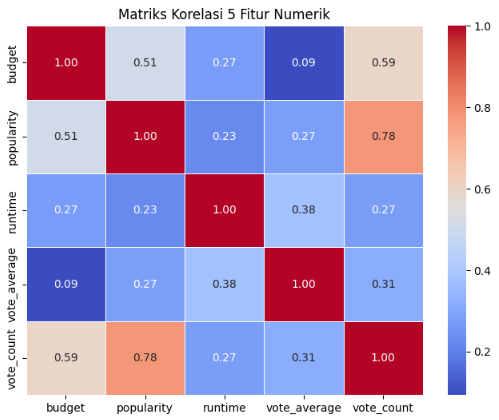

# Laporan Proyek Machine Learning - Rahmah Sary Fadiyah

## Project Overview

Seiring dengan pesatnya pertumbuhan industri hiburan digital, terutama platform layanan streaming seperti Netflix, Disney+, dan Amazon Prime, pengguna dihadapkan pada pilihan ribuan film dan serial setiap harinya. Tantangan utama yang muncul adalah bagaimana menyajikan konten yang relevan dan sesuai dengan preferensi pengguna tanpa membuat mereka kewalahan dengan terlalu banyak pilihan. Oleh karena itu, sistem rekomendasi menjadi komponen penting dalam meningkatkan pengalaman pengguna dengan menyarankan konten yang kemungkinan besar akan disukai pengguna.

Masalah utama yang hendak diselesaikan adalah bagaimana mengidentifikasi film yang relevan bagi pengguna secara personal. Tanpa sistem rekomendasi yang efektif, pengguna bisa merasa frustasi dan kehilangan ketertarikan pada layanan yang ditawarkan. Sistem rekomendasi dapat mengatasi permasalahan ini dengan menganalisis preferensi pengguna, riwayat penelusuran, serta kesamaan antar konten atau antar pengguna lainnya [1].

## Business Understanding
### Problem Statements

Pernyataan masalah:
- Bagaimana cara membantu pengguna menemukan film yang sesuai dengan selera dan preferensi mereka di tengah banyaknya pilihan film yang tersedia?
- Bagaimana cara meningkatkan kepuasan dan keterlibatan pengguna melalui sistem rekomendasi yang lebih tepat sasaran?

### Goals

Menjelaskan tujuan proyek yang menjawab pernyataan masalah:
- Membangun sistem rekomendasi film yang mampu memahami dan memetakan preferensi pengguna secara akurat agar pengguna dapat menemukan film yang sesuai dengan selera mereka dengan cepat dan mudah di antara banyaknya pilihan film.
- Meningkatkan kepuasan dan keterlibatan pengguna pada platform dengan memberikan rekomendasi film yang lebih relevan dan personal, sehingga pengguna merasa lebih dihargai dan terdorong untuk terus menggunakan layanan.
Semua poin di atas harus diuraikan dengan jelas. Anda bebas menuliskan berapa pernyataan masalah dan juga goals yang diinginkan.

    ### Solution statements
    - Content-Based Filtering (CBF)
      Pendekatan ini memanfaatkan data atribut film seperti genre, keywords, overview, cast, dan director untuk membuat profil film dan profil preferensi pengguna. Sistem akan merekomendasikan film yang memiliki kemiripan konten dengan film-film yang pernah disukai atau ditonton oleh pengguna. Dengan demikian, pengguna dapat menemukan film yang sesuai selera secara cepat dan tepat.

    - Collaborative Filtering (CF)
      Metode ini menggunakan data interaksi pengguna (misalnya rating atau voting) untuk menemukan pola kesamaan preferensi antar pengguna. Rekomendasi diberikan berdasarkan film yang disukai oleh pengguna lain dengan preferensi serupa. Pendekatan ini meningkatkan relevansi rekomendasi dan memperkaya variasi film yang diberikan, sehingga dapat meningkatkan kepuasan dan keterlibatan pengguna.

    - Hybrid Recommendation System
      Kombinasi antara Content-Based Filtering dan Collaborative Filtering, yang bertujuan memanfaatkan keunggulan keduanya. Sistem hybrid dapat mengatasi keterbatasan masing-masing metode, seperti cold-start problem dan overspecialization, sehingga memberikan rekomendasi yang lebih personal, relevan, dan beragam bagi pengguna.

    - Incorporating Popularity and Trend Factors
      Menambahkan bobot popularitas (vote_count, popularity) dan tren rilis terbaru (release_date) dalam algoritma rekomendasi agar film yang direkomendasikan tidak hanya sesuai selera tetapi juga sedang digemari banyak pengguna, sehingga meningkatkan keterlibatan dan kepuasan pengguna.

## Data Understanding
Dataset yang digunakan dalam proyek ini berisi informasi tentang film-film yang tersedia pada sebuah platform streaming. Dataset terdiri dari **4.803 entri film** dengan berbagai atribut yang menggambarkan karakteristik film tersebut. Data ini mencakup informasi seperti genre, judul asli, bahasa, durasi, tanggal rilis, dan rating film. Dataset ini berasal dari [The Movie Database](https://www.kaggle.com/datasets/abdallahwagih/movies) dataset yang dapat diunduh secara gratis dari Kaggle.
Selanjutnya, uraikanlah seluruh variabel atau fitur pada data dengan jumlah **24 kolom** sebagai berikut: 
- index : Nomor indeks baris data.
- budget : Anggaran produksi film dalam satuan dolar.
- genres : Genre atau kategori film (misalnya Drama, Action).
- homepage : URL situs resmi film (jika tersedia).
- id : ID unik film.
- keywords : Kata kunci yang mendeskripsikan film.
- original_language : Bahasa asli film.
- original_title : Judul asli film.
- overview : Ringkasan cerita film.
- popularity : Skor popularitas film berdasarkan metrik internal platform.
- production_companies : Perusahaan produksi film.
- production_countries : Negara tempat film diproduksi.
- release_date : Tanggal rilis film.
- revenue : Pendapatan film dalam satuan dolar.
- runtime : Durasi film dalam menit.
- spoken_languages : Bahasa yang digunakan dalam film.
- status : Status rilis film (misalnya Released).
- tagline : Slogan film.
- title : Judul film.
- vote_average : Rata-rata rating film dari pengguna
- vote_count : Jumlah pengguna yang memberikan rating.
- cast : Daftar aktor utama dalam film.
- crew : Daftar kru produksi film.
- director : Sutradara film.

dengan tipe data seperti berikut: 
| #  | Column                | Non-Null Count | Dtype   |
|-----|----------------------|----------------|---------|
| 0   | index                 | 4803 non-null  | int64   |
| 1   | budget                | 4803 non-null  | int64   |
| 2   | genres                | 4775 non-null  | object  |
| 3   | homepage              | 1712 non-null  | object  |
| 4   | id                    | 4803 non-null  | int64   |
| 5   | keywords              | 4391 non-null  | object  |
| 6   | original_language     | 4803 non-null  | object  |
| 7   | original_title        | 4803 non-null  | object  |
| 8   | overview              | 4800 non-null  | object  |
| 9   | popularity            | 4803 non-null  | float64 |
| 10  | production_companies  | 4803 non-null  | object  |
| 11  | production_countries  | 4803 non-null  | object  |
| 12  | release_date          | 4802 non-null  | object  |
| 13  | revenue               | 4803 non-null  | int64   |
| 14  | runtime               | 4801 non-null  | float64 |
| 15  | spoken_languages      | 4803 non-null  | object  |
| 16  | status                | 4803 non-null  | object  |
| 17  | tagline               | 3959 non-null  | object  |
| 18  | title                 | 4803 non-null  | object  |
| 19  | vote_average          | 4803 non-null  | float64 |
| 20  | vote_count            | 4803 non-null  | int64   |
| 21  | cast                  | 4760 non-null  | object  |
| 22  | crew                  | 4803 non-null  | object  |
| 23  | director              | 4773 non-null  | object  |

| Statistik | index  |     budget     |      id       |  popularity  |    revenue    |  runtime  | vote_average | vote_count |
|-----------|--------|---------------|--------------|--------------|---------------|-----------|--------------|------------|
| count     | 4803   | 4,803         | 4803         | 4803         | 4,803         | 4801      | 4803         | 4803       |
| mean      | 2401.0 | 29,045,040.43 | 57,165.48    | 21.49        | 82,260,640.64 | 106.88    | 6.09         | 690.22     |
| std       | 1386.65| 40,722,390.33 | 88,694.61    | 31.82        | 162,857,100.87| 22.61     | 1.19         | 1234.59    |
| min       | 0      | 0             | 5            | 0            | 0             | 0         | 0            | 0          |
| 25%       | 1200.5 | 790,000       | 9,014.5      | 4.67         | 0             | 94.0      | 5.6          | 54         |
| 50%       | 2401.0 | 15,000,000    | 14,629       | 12.92        | 19,170,000    | 103.0     | 6.2          | 235        |
| 75%       | 3601.5 | 40,000,000    | 58,610.5     | 28.31        | 92,917,190    | 118.0     | 6.8          | 737        |
| max       | 4802   | 380,000,000   | 459,488      | 875.58       | 2,787,965,000 | 338.0     | 10           | 13,752     |
Penjelasan:
- Data menunjukkan variasi besar dalam anggaran, popularitas, dan pendapatan film, mencerminkan perbedaan antara film low-budget hingga blockbuster.
- Sebagian data seperti anggaran dan revenue mengandung nilai 0, mungkin perlu diproses lebih lanjut untuk mengatasi data hilang.
- Durasi film rata-rata sekitar 1,5 jam, cukup standar untuk film bioskop.
- Rating dan jumlah voting bervariasi, memungkinkan analisis lebih lanjut untuk mencari film dengan kualitas dan popularitas tinggi.

**Kondisi dari data**:
- missing value

  | Kolom                | Jumlah Missing Value |
  |----------------------|---------------------:|
  | index                | 0                    |
  | budget               | 0                    |
  | genres               | 28                   |
  | homepage             | 3091                 |
  | id                   | 0                    |
  | keywords             | 412                  |
  | original_language    | 0                    |
  | original_title       | 0                    |
  | overview             | 3                    |
  | popularity           | 0                    |
  | production_companies | 0                    |
  | production_countries | 0                    |
  | release_date         | 1                    |
  | revenue              | 0                    |
  | runtime              | 2                    |
  | spoken_languages     | 0                    |
  | status               | 0                    |
  | tagline              | 844                  |
  | title                | 0                    |
  | vote_average         | 0                    |
  | vote_count           | 0                    |
  | cast                 | 43                   |
  | crew                 | 0                    |
  | director             | 30                   |

Penjelasaanya:
    - Kolom homepage memiliki jumlah missing value paling banyak yaitu 3091, ini karena tidak semua film memiliki halaman resmi.
    - Beberapa kolom seperti genres, keywords, tagline, cast, dan director juga memiliki missing value yang cukup signifikan, perlu dipertimbangkan saat analisis.
    - Kolom penting seperti budget, revenue, vote_average, dan title tidak memiliki missing value, sehingga data utama terkait performa film relatif lengkap.
    - Data missing di kolom seperti runtime 2 dan release_date 1 sangat sedikit, tagline memiliki 844, cast 43, direktur 30,genres 28, dan keyword 412
    
- Duplikat data
 Data yang digunakan dalam dataset ini telah melalui proses pengecekan untuk memastikan keunikan setiap entri. Hasil pemeriksaan menunjukkan bahwa tidak terdapat duplikat data pada seluruh baris dataset, yang berarti setiap rekaman film adalah unik dan tidak berulang.

| Fitur 1        | Fitur 2      | Korelasi | Interpretasi                                                                               |
| -------------- | ------------ | -------- | ------------------------------------------------------------------------------------------ |
| `popularity`   | `vote_count` | 0.78     | Sangat kuat positif — Film yang populer cenderung mendapat banyak vote.                    |
| `budget`       | `vote_count` | 0.59     | Cukup kuat positif — Film dengan anggaran besar cenderung mendapat lebih banyak suara.     |
| `budget`       | `popularity` | 0.51     | Sedang positif — Film dengan budget besar cenderung populer.                               |
| `vote_average` | `runtime`    | 0.38     | Lemah hingga sedang — Film yang lebih lama cenderung mendapat rating sedikit lebih tinggi. |
| `vote_average` | `budget`     | 0.09     | Sangat lemah — Budget tidak berpengaruh signifikan ke rating.                              |

## Data Preparation
Pada bagian ini Anda menerapkan dan menyebutkan teknik data preparation yang dilakukan. Teknik yang digunakan pada notebook dan laporan harus berurutan.

**Rubrik/Kriteria Tambahan (Opsional)**: 
- Menjelaskan proses data preparation yang dilakukan
- Menjelaskan alasan mengapa diperlukan tahapan data preparation tersebut.

## Modeling
Tahapan ini membahas mengenai model sisten rekomendasi yang Anda buat untuk menyelesaikan permasalahan. Sajikan top-N recommendation sebagai output.

**Rubrik/Kriteria Tambahan (Opsional)**: 
- Menyajikan dua solusi rekomendasi dengan algoritma yang berbeda.
- Menjelaskan kelebihan dan kekurangan dari solusi/pendekatan yang dipilih.

## Evaluation
Pada bagian ini Anda perlu menyebutkan metrik evaluasi yang digunakan. Kemudian, jelaskan hasil proyek berdasarkan metrik evaluasi tersebut.

Ingatlah, metrik evaluasi yang digunakan harus sesuai dengan konteks data, problem statement, dan solusi yang diinginkan.

**Rubrik/Kriteria Tambahan (Opsional)**: 
- Menjelaskan formula metrik dan bagaimana metrik tersebut bekerja.

**---Ini adalah bagian akhir laporan---**

_Catatan:_
- _Anda dapat menambahkan gambar, kode, atau tabel ke dalam laporan jika diperlukan. Temukan caranya pada contoh dokumen markdown di situs editor [Dillinger](https://dillinger.io/), [Github Guides: Mastering markdown](https://guides.github.com/features/mastering-markdown/), atau sumber lain di internet. Semangat!_
- Jika terdapat penjelasan yang harus menyertakan code snippet, tuliskan dengan sewajarnya. Tidak perlu menuliskan keseluruhan kode project, cukup bagian yang ingin dijelaskan saja.
